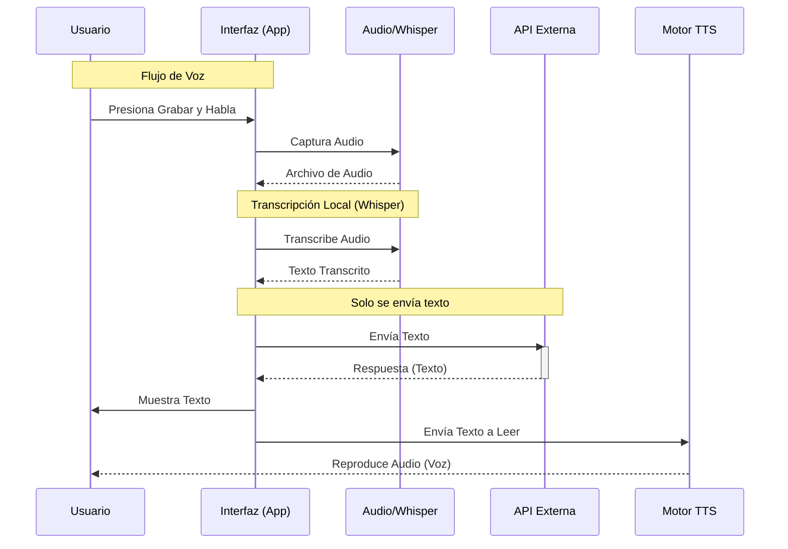

# Feature Specification: Asistente de Chat

**Feature Branch**: `001-chat-assistant`
**Created**: 2025-12-11
**Status**: Draft
**Input**: User description: "quiero crear un chat como asistente que pueda entender audio , texto y ya sea con un tts o texto ver mis resultados este funcionara como un asistente esta parte es por asi decirlo la aplicacion cliente aparte estoy haciendo el api, esto lo defines en espaniol, si puedes darme un diagrama de como sera este flujo"

## User Scenarios & Testing

### User Story 1 - Interacción por Texto (Priority: P1)

El usuario puede enviar mensajes de texto al asistente y recibir respuestas textuales.

**Why this priority**: Es la funcionalidad base de cualquier chat y permite la comunicación silenciosa.

**Independent Test**: Enviar un mensaje "Hola" y verificar que aparece en la lista y se recibe una respuesta simulada o real.

**Acceptance Scenarios**:

1. **Given** el usuario está en la pantalla de chat, **When** escribe "Hola" y presiona enviar, **Then** el mensaje aparece en el historial como enviado por el usuario.
2. **Given** se envió un mensaje, **When** el asistente responde, **Then** la respuesta aparece en el historial como recibida.

---

### User Story 2 - Interacción por Voz (Audio) (Priority: P2)

El usuario puede grabar un mensaje de audio, el cual es transcrito a texto **exclusivamente en el dispositivo móvil** usando Whisper. **Nunca se envía el archivo de audio al servidor**; únicamente se envía el texto resultante de la transcripción local.

**Why this priority**: Permite la interacción manos libres y natural, garantizando privacidad y velocidad al no subir audio.

**Independent Test**: Grabar un audio corto, enviarlo y verificar que se procesa y se recibe respuesta.

**Acceptance Scenarios**:

1. **Given** el usuario está en el chat, **When** mantiene presionado el botón de micrófono, **Then** se inicia la grabación de audio visualmente.
2. **Given** el usuario suelta el botón de micrófono, **When** la grabación finaliza, **Then** el audio se procesa/envía al asistente.

---

### User Story 3 - Respuesta de Voz (TTS) (Priority: P2)

El usuario puede escuchar la respuesta del asistente mediante síntesis de voz (Text-to-Speech). El usuario tiene el control de decidir si desea escuchar la respuesta automáticamente o solo leerla.

**Why this priority**: Completa la experiencia de asistente de voz bidireccional, pero respeta la privacidad y preferencia del usuario.

**Independent Test**: Recibir un mensaje con la opción de voz activada (debe sonar) y desactivada (no debe sonar).

**Acceptance Scenarios**:

1. **Given** la opción de "Leer respuestas en voz alta" está activada, **When** llega una respuesta del asistente, **Then** el audio se reproduce automáticamente.
2. **Given** la opción de "Leer respuestas en voz alta" está desactivada, **When** llega una respuesta, **Then** solo se muestra el texto y no se reproduce audio automáticamente.
3. **Given** una respuesta ya recibida, **When** el usuario presiona el botón de "Reproducir" en el mensaje, **Then** el audio se reproduce independientemente de la configuración automática.

---

## Functional Requirements

1.  **Interfaz de Chat (UI)**:
    *   Pantalla principal de chat con lista de mensajes (scrollable).
    *   Componentes de mensaje diferenciados (Usuario vs Asistente).
    *   Barra de entrada con campo de texto y botón de acción (Enviar/Grabar).
    *   Indicadores de estado (Grabando, Procesando, Escribiendo).
    *   **Control de Preferencia de Voz**: Botón o configuración para activar/desactivar la lectura automática de respuestas (Mute/Unmute).

2.  **Gestión de Audio (Input)**:
    *   Solicitud y manejo de permisos de micrófono.
    *   Captura de audio mediante el micrófono del dispositivo.
    *   **Transcripción Local Obligatoria**: Uso de modelo de IA en dispositivo (Whisper) para convertir audio a texto. **Restricción**: No existe funcionalidad para subir archivos de audio al backend.

3.  **Gestión de Audio (Output - TTS)**:
    *   Síntesis de voz para leer las respuestas del asistente.
    *   Configuración de idioma (Español) y velocidad de voz.
    *   Manejo de eventos de reproducción (inicio, fin, error).
    *   **Lógica de Reproducción Condicional**: Verificar la preferencia del usuario antes de iniciar la reproducción automática.

4.  **Integración API**:
    *   Servicio para comunicación con el backend (API externa).
    *   Definición de contratos de datos (Mensajes, Respuestas).

## Success Criteria

*   **Latencia**: El usuario percibe el inicio de la respuesta (texto o audio) en menos de 3 segundos tras el envío (excluyendo latencia de red severa).
*   **Fiabilidad**: La grabación de audio no falla en el 95% de los intentos en condiciones normales.
*   **Usabilidad**: El usuario puede alternar entre texto y voz fluidamente sin configuraciones complejas.
*   **Claridad**: El TTS reproduce el texto en español de manera inteligible para un hablante nativo.

## Key Entities

*   **Message**: Objeto que representa un mensaje individual.
    *   `id`: Identificador único.
    *   `text`: Contenido textual.
    *   `sender`: 'user' | 'assistant'.
    *   `type`: 'text' | 'audio'.
    *   `timestamp`: Fecha y hora.
*   **ChatState**: Estado local de la conversación (lista de mensajes, estado de carga, estado de grabación).

## Diagrama de Flujo

## Assumptions

*   La API externa ya está en desarrollo y proveerá los endpoints necesarios.
*   Se utilizarán las librerías ya instaladas en el proyecto (`whisper.rn`, `react-native-tts`, `react-native-permissions`) para sus respectivos propósitos.
*   El idioma principal de interacción es Español.
